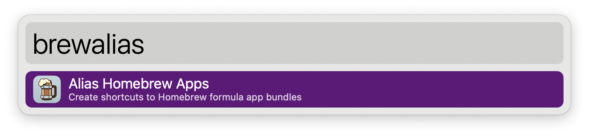

#  Alias Homebrew Apps Alfred Workflow

Create shortcuts to Homebrew formula app bundles

<a href='https://github.com/alfredapp/alias-homebrew-apps-workflow/releases/latest/download/Alias.Homebrew.Apps.alfredworkflow'>⤓ Download Workflow</a>

> On Alfred 4 use <a href='https://github.com/alfredapp/alias-homebrew-apps-workflow/releases/download/2022.2/Alias.Homebrew.Apps.alfredworkflow'>alternative link</a>

## Usage

Configure the formulae you want linked and run the Alias Keyword (default: `brewalias`). App bundles will be aliased into your Applications directory, allowing them to be indexed and invoked like other apps.



You can run the Workflow from a Terminal via the External Trigger. The simplest way is to define an alias in your shell’s startup files:

```
alias brewalias='/usr/bin/osascript -e "tell application id \"com.runningwithcrayons.Alfred\" to run trigger \"build\" in workflow \"com.alfredapp.aliashomebrewapps\""'
```

Then executing `brewalias` in a Terminal will run the Workflow.
