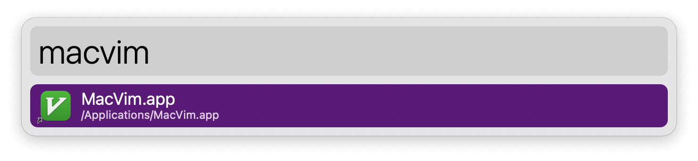

#  Alias Homebrew Apps Alfred Workflow

Create shortcuts to Homebrew formula app bundles

[⤓ Install on the Alfred Gallery](https://alfred.app/workflows/alfredapp/alias-homebrew-apps)

> On Alfred 4 use <a href='https://github.com/alfredapp/alias-homebrew-apps-workflow/releases/download/2022.2/Alias.Homebrew.Apps.alfredworkflow'>alternative link</a>

## Setup

Set the formulae you want linked in the [Workflow’s Configuration](https://www.alfredapp.com/help/workflows/user-configuration/).

## Usage

Alias your Homebrew Cellar apps to the Applications Folder via the `brewalias` keyword. This will allow them to be indexed by macOS and found.




To trigger the workflow from a terminal, define a `brewalias` command in your shell’s startup files:

```
alias brewalias='/usr/bin/osascript -e "tell application id \"com.runningwithcrayons.Alfred\" to run trigger \"build\" in workflow \"com.alfredapp.vitor.aliashomebrewapps\""'
```
