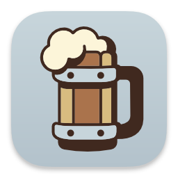

#  Alias Homebrew Apps Alfred Workflow

Create shortcuts to Homebrew formula app bundles

<a href='https://github.com/alfredapp/alias-homebrew-apps-workflow/releases/latest/download/Alias.Homebrew.Apps.alfredworkflow'>⤓ Download Workflow</a>

## About

<!-- BEGIN ABOUT -->

Apps built via Homebrew formulae are nested deep in the `Cellar` and not indexed by Spotlight (and thus Alfred). This Workflow takes care of that.

Set up the `formulae` Workflow Environment Variable as a comma-separated list of formula names. Run `brewalias` and app bundles found under those will be aliased into your Applications directory, allowing them to be indexed and invoked like other apps.


Make `formulae` empty to create aliases for all app bundles under your Homebrew Cellar. This may add more than you want.

The `applications_dir` Workflow Environment Variable sets the directory to save the aliases to, like `/Applications` or `~/Applications`.

You can run the Workflow from a Terminal via the External Trigger. The simplest way is to define an alias in your shell’s startup files:

```
alias brewalias='/usr/bin/osascript -e "tell application id \"com.runningwithcrayons.Alfred\" to run trigger \"build\" in workflow \"com.alfredapp.aliashomebrewapps\""'
```

Then executing `brewalias` in a Terminal will run the Workflow.

<!-- END ABOUT -->

<a href='https://github.com/alfredapp/alias-homebrew-apps-workflow/releases/latest/download/Alias.Homebrew.Apps.alfredworkflow'>⤓ Download Workflow</a>
